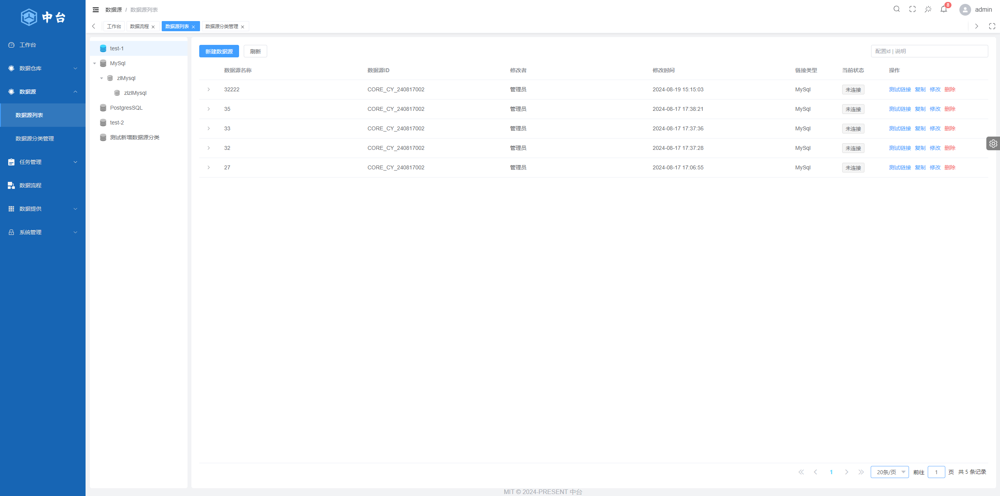
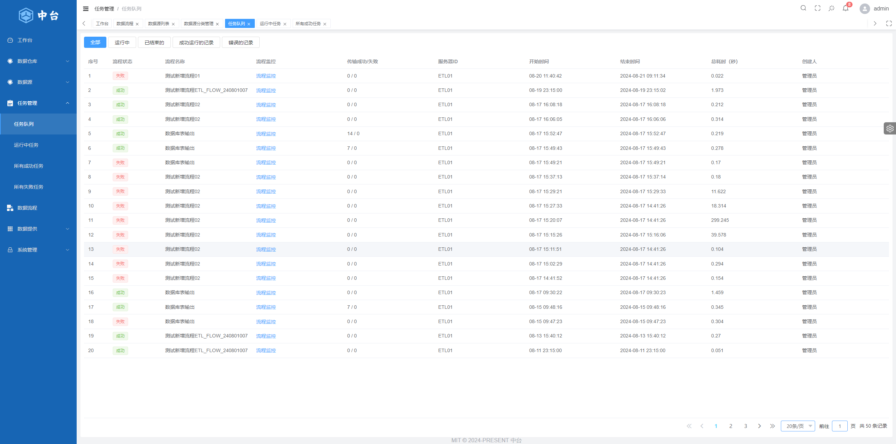

<div align="center">
  
  <h1>Dass数据融合中台</h1>
</div>

## ⚡ 简介

- Dass数据融合中台系统
- Vue Cli 5.x + Vue3 + ts + element-plus + pinia + antv

仓库地址：[GitLab](http://60.70.1.223:18082/zxsw/platform)

## 📺 项目网址

| 位置     | 账号            | 链接                                       |
| -------- | --------------- | ------------------------------------------ |
| hz服务器 | admin 或 editor | [链接](http://192.168.0.209:18110/#/login) |

- **Vue3**：采用 Vue3 + script setup 最新的 Vue3 组合式 API
- **Element Plus**：Element UI 的 Vue3 版本
- **Pinia**: 传说中的 Vuex5
- **Vite**：真的很快
- **Vue Router**：路由路由
- **TypeScript**：JavaScript 语言的超集
- **Scss**：和 Element Plus 保持一致
- **CSS 变量**：主要控制项目的布局和颜色
- **ESlint**：代码校验
- **Prettier**：代码格式化
- **Axios**：发送网络请求（已封装好）
- **UnoCSS**：具有高性能且极具灵活性的即时原子化 CSS 引擎
- **兼容移动端**: 未兼容 ！！！！！！！

## 功能

- **用户管理**：登录、登出演示
- **数据源**：数据源列表、分类、分类管理
- **任务管理**：任务队列、状态分类
- **数据流程**：数据流程、流程设计、节点配置
- **权限管理**：页面级权限（动态路由）、按钮级权限（指令权限、权限函数）、路由守卫
- **多环境**：开发环境（development）、预发布环境（staging）、正式环境（production）
- **多主题**：普通、黑暗、深蓝, 三种主题模式
- **多布局**：左侧、顶部、混合, 三种布局模式
- **错误页面**: 403、404
- **Dashboard**：根据不同用户显示不同的 Dashboard 页面
- **其他内置功能**：SVG、动态侧边栏、动态面包屑、标签页快捷导航、Screenfull 全屏、自适应收缩侧边栏、Hook（Composables）

## 🚀 开发

```bash
# 配置
1. 一键安装 .vscode 目录中推荐的插件
2. node 版本 18.16.0
3. pnpm 版本 8.x 以上

# 进入项目目录
cd platform

# 安装依赖
npm install

# 启动服务
npm run dev
```

## ✔️ 预览

```bash
# 预览预发布环境
pnpm preview:stage

# 预览正式环境
pnpm preview:prod
```

## 📦️ 多环境打包

```bash
# 构建预发布环境
npm build:stage

# 构建正式环境
npm build:prod
```

## 🔧 代码检查

```bash
# 代码格式化
pnpm lint

# 单元测试
pnpm test
```

## Git 提交规范参考

- `feat` 增加新的业务功能
- `fix` 修复业务问题/BUG
- `perf` 优化性能
- `Optimization` 优化现有功能
- `style` 更改代码风格, 不影响运行结果
- `refactor` 重构代码
- `revert` 撤销更改
- `test` 测试相关, 不涉及业务代码的更改
- `docs` 文档和注释相关
- `chore` 更新依赖/修改脚手架配置等琐事
- `workflow` 工作流改进
- `ci` 持续集成相关
- `types` 类型定义文件更改
- `wip` 开发中

## 项目预览图






## 📄 License

[MIT](./LICENSE)

Copyright © 2024-present - wlw7890000@163.com
